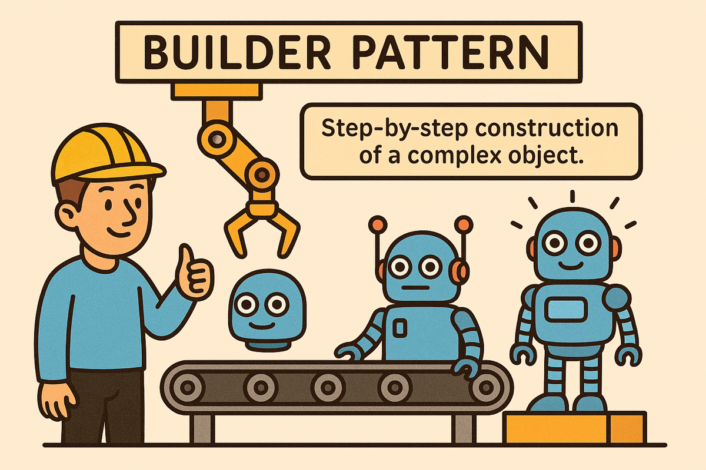
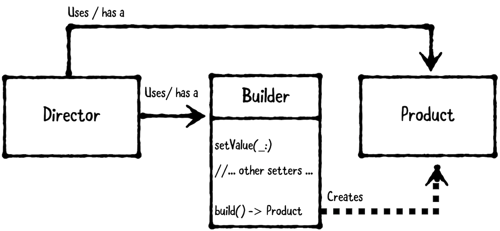

- [Builder 패턴](#Builder%20패턴)
- [필요한 이유](#필요한%20이유)
- [사용](#사용)
- [참고](#참고)
# Builder 패턴


> 복잡한 객체를 생성할 때 유용한 패턴!

복잡한 객체를 생성할때 유용한 패턴이다.
예시로 공장의 컨베이어 벨트를 연상시킬 수 있다.

맥북을 컨베이어 벨트 시스템으로 만든다고 가정하면,
사용자가 주문한 대로
1. Ram 삽입 (16 / 24 / 32GB)
2. Storage 삽입 (256 / 512GB)
3. 칩셋 삽입 (M1 / M1pro / M1max)
그리고 마지막으로 완성된 맥북을 포장한다!

이처럼 순차적으로 주문에 맞는 부품을 넣어서 완성품을 만든다는 방식을 차용해 문제를 해결한게 **Builder 패턴**이다

빌더 패턴은 동일한 순서로 또는 특정 알고리즘을 사용하여 생성되어야 하는 구성 요소를 가진 복잡한 개체를 생성하는 데 사용됩니다. 외부 클래스는 구성 알고리즘을 제어합니다.
# 필요한 이유
객체의 생성자가 너무 많아지는 경우, 선택적으로 설정 가능한 속성이 많아질 경우,
생성자가 복잡해지고 실수가 생길 수 있다.

이때 Builder는 생성, 설정을 분리해 가독성과 안정성을 높여준다!

### 언제 써야할까?
- 인스턴스에 설정할 프로퍼티가 많고, 일부는 선택사항일 때
- 생성자에 너무 많은 매개변수가 전달되어 가독성이 떨어질 때
- 불변 객체를 안전하게 생성하고자 할 때

|           **장점**            |        **단점**        |
| :---------------------------: | :--------------------: |
|  복잡한 객체 생성 과정을 분리해 가독성 높음   | 클래스가 늘어나 코드가 다소 복잡해짐 |
| 메서드 체이닝을 통해 설정 과정을 직관적으로 표현 |  간단한 객체에는 오히려 과한 구조  |
|    필수 값, 선택 값  구분이 명확해짐     |                      |


# 사용

다이어그램을 보고 먼저 구조를 살펴보자
- `Director`는 input을 받아 builder로 객체를 생성한다 (iOS 기준으로는 ViewController등 객체를 생성하기위한 작성을 하는 부분)
- `Builder`는 단계별 입력을 받아 객체를 만든다. 그리고 `build()`메서드로 객체를 생성한다.
- `Product`는 `Builder`가 최종 반환해주는 복잡한 객체

Builder 패턴은 클래스의 프로퍼티를 하나하나 설정하는 방식을 연쇄적으로 진행 후 객체를 반환하는 방식으로 구현된다.
```swift
struct MacBook {
    let color: String
    let memory: Int
    let storage: String
    let hasTouchBar: Bool
}
// ⭐️ 빌더
class MacBookBuilder {
    private var color = "Space Gray"
    private var memory = 16
    private var storage = "256GB"
    private var hasTouchBar = false

    func setColor(_ color: String) -> MacBookBuilder {
        self.color = color
        return self
    }

    func setMemory(_ memory: Int) -> MacBookBuilder {
        self.memory = memory
        return self
    }

    func setStorage(_ storage: String) -> MacBookBuilder {
        self.storage = storage
        return self
    }

    func setHasTouchBar(_ has: Bool) -> MacBookBuilder {
        self.hasTouchBar = has
        return self
    }

    func build() -> MacBook {
        return MacBook(color: color, memory: memory, storage: storage, hasTouchBar: hasTouchBar)
    }
}

let builder = MacBookBuilder()
// ⭐️ 사용
let macBook1 = builder.setColor("Silver").setMemory(32).setStorage("512").setHasTouchBar(true).build()
let macBook2 = builder.setMemory(32).setStorage("1TB").build()
let macBook3 = builder.build()

```

모델을 보면 내부 프로퍼티가 다 불변으로 되어있다!
원래라면 생성시 한번에 넣어주지 않는다면.. 상당히 귀찮아진다.
하지만, Builder 패턴에서 임시로 상태를 관리하고 있기 때문에 생성할 때 까지 mutable helper 역할을 해주고 있는 것이다.

## Swift 스타일의 Builder!
Swift의 Closure를 사용해 Builder 패턴을 구현한 예제
```swift
final class DeathStarBuilder {

    var x: Double?
    var y: Double?
    var z: Double?

    typealias BuilderClosure = (DeathStarBuilder) -> ()

    init(buildClosure: BuilderClosure) {
        buildClosure(self)
    }
}

struct DeathStar : CustomStringConvertible {

    let x: Double
    let y: Double
    let z: Double

    init?(builder: DeathStarBuilder) {

        if let x = builder.x, let y = builder.y, let z = builder.z {
            self.x = x
            self.y = y
            self.z = z
        } else {
            return nil
        }
    }

    var description:String {
        return "Death Star at (x:\(x) y:\(y) z:\(z))"
    }
}
```
Closure를 이용해 DeathStarBuilder 클래스를 Builder 스타일로 생성한다.
```swift
let empire = DeathStarBuilder { builder in
    builder.x = 0.1
    builder.y = 0.2
    builder.z = 0.3
}

let deathStar = DeathStar(builder:empire)
```
사용 역시 간단하게 builder의 속성을 정의해주면 된다.

# 참고
Swift 스타일의 Builder를 보면, SwiftUI의 뷰 또는 `ResultBuilder`와 비슷한거 같지 않나? + Than 라이브러리랑 비슷하지 않나? 라는 생각이 들었다.

하지만 Builder 패턴을 적용했다! 보다는 Builder의 개념을 활용한 문법 또는 변형..? 정도로 보는것이 좋은 거 같다.