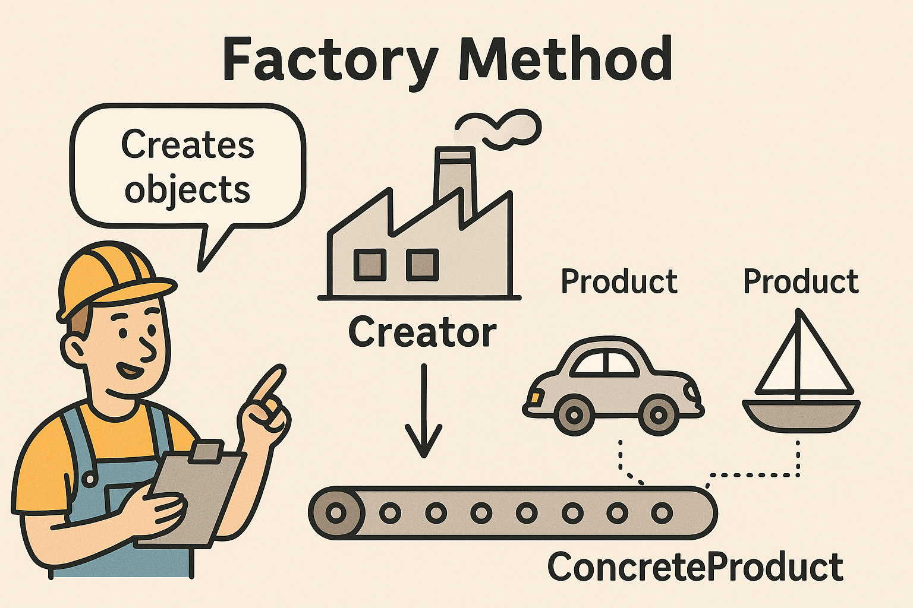
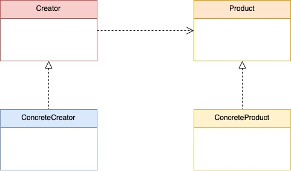

- [Factory Method 패턴](#Factory%20Method%20패턴)
- [필요한 이유](#필요한%20이유)
- [사용](#사용)
# Factory Method 패턴


>  **팩토리 메서드는 “객체를 어떻게 만들 것인가”를 캡슐화해서, 코드의 유연성과 확장성을 높이는 패턴입니다.**

Factory Method 패턴은 제품에 따라 공장의 생산라인을 바꾸는게 아닌,
기본이 되는 생산라인은 설치해두고 **"요청에 맞는 제품을 생산해주는 패턴"** 이라고 생각하면 된다.

여기서 포인트는!! "어떤 요청이 들어올지 모른다는 점"

의존성 주입과 개념이 비슷한데 사용법을 보면 이유를 알 수 있다.
# 필요한 이유
유연하고 확장 가능한 구조를 만들고 싶을 때 사용한다!
- 객체 생성 로직을 숨기고 캡슐화 하고 싶을때
- 객체 생성 코드를 공통화 하고 싶을때
- 코드를 유연하게 확장하고 싶을 때 (OCP 원칙 지킴

|                     **장점**                      |                           **단점**                           |
| :---------------------------------------------: | :--------------------------------------------------------: |
| 유연하고 확장성 높음<br>(기존 코드 변경없이 새로운 하위 클래스를 추가가 가능)  | 불필요하게 많은 클래스 정의<br>(`Product`가 추가될 때 마다 새로운 하위 클래스를 정의해야함) |
| 수정이 용이함<br>(코드 수정사항이 생겨도 FactoryMethod만 수정하면 됨) |                    중첩되어 사용되면 복잡해질 수 있음                     |
|                                                 |                                                            |

# 사용


다이어그램을 보고 먼저 구조를 살펴보자
- `Product`는 `Creater`와 하위 클래스가 생성할 수 있는 모든 객체에 동일한 프로토콜 선언
- `Concreate Product`는 `Product`를 채택해 구현한 실제 객체
- `Creator`는 새로운 객체를 반환하는  factory method를 선언함.
  여기서 반환되는 객체는 항상 Product 프로토콜을 준수한다.
- `Concrete Creator`는 기본 factory method를 재정의해 서로 다른 Product를 생성한다.
### 정석적인 방식
```swift
// Creator
protocol AppleFactory {
    func createElectronics() -> Product
}

// Concrete Creator
class IPhoneFactory: AppleFactory {
    func createElectronics() -> Product {
        return IPhone()
    }
}

class IPadFactory: AppleFactory {
    func createElectronics() -> Product {
        return IPad()
    }
}

// Product
protocol Product {
    func produceProduct()
}

// Concrete Product
class IPhone: Product {
    func produceProduct() {
        print("Hello, iPhone was made")
    }
}

class IPad: Product {
    func produceProduct() {
        print("Hello, iPad wad made")
    }
}

class Client {
    func order(factory: AppleFactory) {
        let elctronicsProduct = factory.createElectronics()
        elctronicsProduct.produceProduct()
    }
}

var client = Client()

client.order(factory: IPadFactory())
client.order(factory: IPhoneFactory())

/*
Hello, iPad was made
Hello, iPhone was made
*/
```

가장 정석적인 방식으로 Product 프로토콜을 채택한 Concrete Product클래스들을 만들어두고,
Factory를 채택한 Concrete Factory에서 Concrete Product를 생성한다.
### 스위프트 방식
```swift
protocol CurrencyDescribing { // Product
    var symbol: String { get }
    var code: String { get }
}

final class Euro: CurrencyDescribing { // Concrete Product
    var symbol: String {
        return "€"
    }
    
    var code: String {
        return "EUR"
    }
}

final class UnitedStatesDolar: CurrencyDescribing { // Concrete Product
    var symbol: String {
        return "$"
    }
    
    var code: String {
        return "USD"
    }
}

enum Country {
    case unitedStates
    case spain
    case uk
    case greece
}

enum CurrencyFactory { // Concrete Creater
    static func currency(for country: Country) -> CurrencyDescribing? {

        switch country {
            case .spain, .greece:
                return Euro()
            case .unitedStates:
                return UnitedStatesDolar()
            default:
                return nil
        }
        
    }
}
// Usage
let noCurrencyCode = "No Currency Code Available"

CurrencyFactory.currency(for: .greece)?.code ?? noCurrencyCode
CurrencyFactory.currency(for: .spain)?.code ?? noCurrencyCode
CurrencyFactory.currency(for: .unitedStates)?.code ?? noCurrencyCode
CurrencyFactory.currency(for: .uk)?.code ?? noCurrencyCode
```
`enum Country`는 그저 값 분기용이다.
정석 구조는 아니지만, 이 코드도 Factory Method 패턴이라 할 수 있다.
