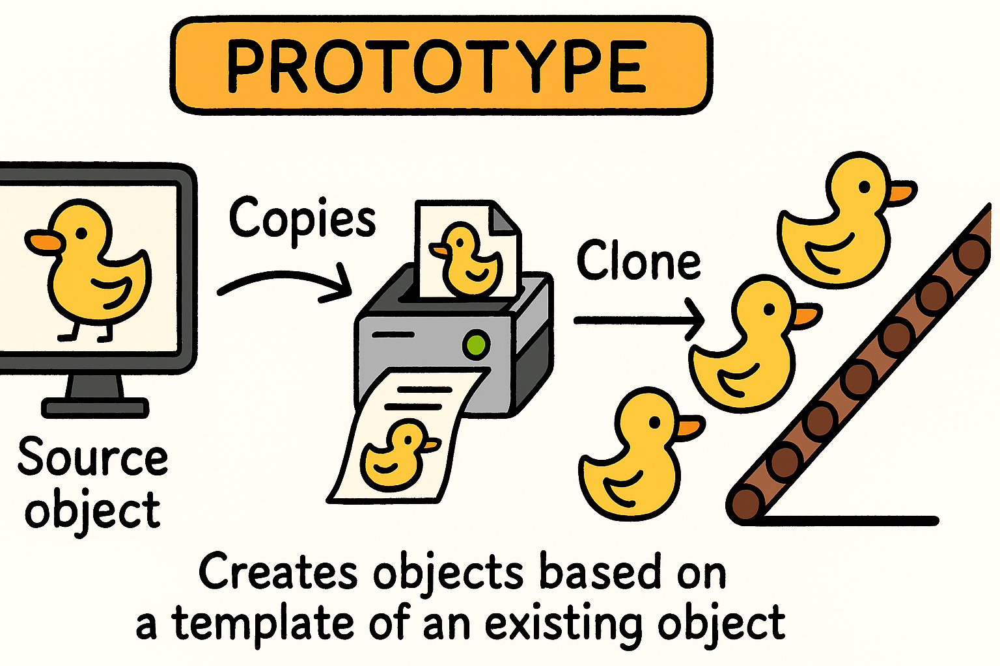
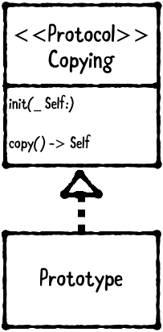

- [Prototype 패턴](#Prototype%20패턴)
- [필요한 이유](#필요한%20이유)
- [사용](#사용)
- [참고](#참고)
# Prototype 패턴


> 기존의 객체를 복제하여 생성하는 패턴

기존의 객체를 복제하기 위한 패턴이다. (자가복제패턴!)

기존 객체와 같은 객체를 하나 더 만들고 싶을때, 새롭게 객체를 만드는 방식이 아닌 자기 자신을 복제하여 반환하는 편이 더 편해서 나오게 된 패턴이다.

중요한점은 **독립적인 클론**을 생성하는것!
# 필요한 이유
위에서 설명했던 것 처럼,
- 동일한 객체를 여러 개 생성해야하는 경우
- 클래스 생성 비용이 클 떄! (복잡한 초기화 과정)
### 장단점

| **장점**                    | **단점**                            |
| :-------------------------: | :---------------------------------: |
| 복잡한 객체를 빠르게 복사 가능         | 깊은 복사가 필요한 경우 구현이 복잡해짐            |
| 런타임시 객체 복제를 통해 유연한 설계 가능  | 원본 객체의 상태가 복제에 영향을 줄 수 있음         |
| 팩토리나 생성자를 쓰지 않고도 객체 생성 가능 | 객체 간 참조가 많을경우, 예상치 못한 공유 상태 발생 가능 |

# 사용

다이어그램을 보고 먼저 구조를 살펴보자
- `Copying`은 복사 방법을 선언하는 프로토콜
- `Prototype`은 `Copying`프로토콜을 채택해 복사를 지원함

사실 Prototype의 경우 너무 간단해서 크게 설명할게 없다. 
바로 코드를 보자.
```swift
protocol Prototype: AnyObject {
    func copy() -> Self
}

class Person: Prototype {
    var age: Int

    init(age: Int) {
        self.age = age
    }

    func copy() -> Self {
        return Person(age: self.age) as! Self
    }
}

let person = Person(age: 500)
person.age += 50
print(person.age)

let person2 = person.copy()
person2.age += 30
print(person2.age)
```
다이어그램을 참고해서 구현해보면 이런 형식으로 만들 수 있다.
근데 꼭.. 프로토콜을 만들어 채택하고 해야하나? 그건 또 아니긴 하다.

그냥 `copy()`메서드만 구현해두면 Prototype 패턴처럼 사용할 수 있다.

여기서 가장 중요한건.. 깊은 복사를 사용해야한다면, 더 복잡해진다는것.
# 참고
깊은복사가 꼭 필요한 경우에 구현비용이 높다면, 다른 생성패턴을 고려하는것이 좋다.

Swift에서 `NSCopying` 프로토콜을 통해 깊은 복사를 구현할 수 있다.
[참조타입에 일어나는 깊은복사와 얕은복사](../../sub/참조타입에%20일어나는%20깊은복사와%20얕은복사.md)
