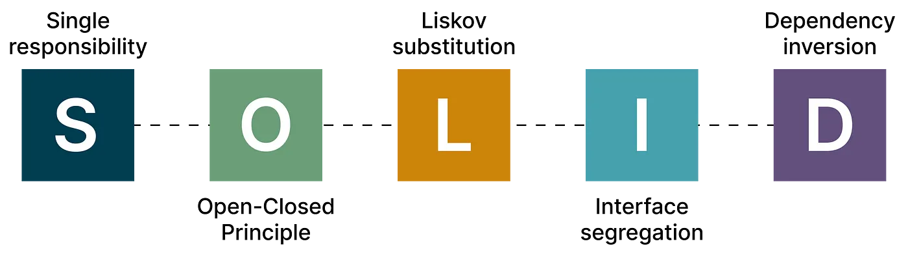

# SOLID

## SOLID란? 
객체 지향 프로그래밍 및 설계의 다섯가지 기본 원칙.
SOLID 원칙을 지킴으로써 유지보수가 쉽고, 유연하고, 확장이 쉬운 소프트웨어를 만들 수 있습니다.
## SOLID 알아보기
[**단일 책임 원칙 (SRP)**](./SOLID/SRP.md): 각 클래스나 모듈은 오직 하나의 책임만 가져야 합니다. 
> Swift에서 이는 클래스가 변경될 수 있는 단 하나의 이유만 가져야 함을 의미합니다.

[**개방-폐쇄 원칙 (OCP)**](./SOLID/OCP.md): 클래스는 확장에는 열려 있어야 하고, 수정에는 닫혀 있어야 합니다. 
> 다시 말해, 기존 코드를 변경하지 않고도 새로운 기능을 추가할 수 있어야 합니다.

[**리스코프 치환 원칙 (LSP)**](./SOLID/LSP.md): 하위 타입은 그들의 상위 타입으로 대체 가능해야 합니다. 
> Swift에서는 어떤 서브클래스든 예기치 않은 동작 없이 부모 클래스를 대체할 수 있어야 한다는 의미입니다.

[**인터페이스 분리 원칙 (ISP)**](./SOLID/ISP.md): 클라이언트는 자신이 사용하지 않는 인터페이스에 의존해서는 안 됩니다.
> Swift에서는 필요하지 않은 메서드를 포함한 큰 프로토콜보다는 더 작고 명확한 프로토콜을 정의해야 합니다.

[**의존 역전 원칙 (DIP)**](./SOLID/DIP.md): 고수준 모듈은 저수준 모듈에 의존해서는 안 됩니다. 대신, 둘 모두 추상화에 의존해야 합니다. 
> Swift에서는 구체적인 구현에 의존하는 대신, 클래스 간의 인터페이스를 프로토콜로 정의해야 함을 의미합니다.

---
# Design Pattern

> **프로그래밍 설계를 할 때 자주 발생하는 문제들을 해결하기 위해 사용되는 패턴, 구조**
- **문제 해결을 위한 설계 방식**이지, 코드 조각이 아님
- 특정 상황에서 검증된 베스트 프랙티스를 정리한 것
- **재사용 가능**하고, 팀원 간의 **공통된 설계 언어**로 사용 가능
- 새로운 코드 작성 시 **유지보수성과 확장성**을 높여줌
## 패턴 분류
- **생성 패턴:** 기존 코드의 재활용과 유연성을 증가시키는 객체 생성 메커니즘들을 제공합니다.
- **구조 패턴:** 구조를 유연하고 효율적으로 유지하면서 객체와 클래스를 더 큰 구조로 조합하는 방법을 설명합니다.
- **행동 패턴:** 객체 간의 효과적인 의사소통과 책임 할당을 처리합니다.

| Creational (생성)                                                            | Structural (구조)    | Behavioral (행위)            |
| -------------------------------------------------------------------------- | ------------------ | -------------------------- |
| [🌰 Abstract Factory](./Design%20Pattern/Creational/Abstract%20Factory.md) | 🔌 Adapter         | 🐝 Chain Of Responsibility |
| [👷 Builder](./Design%20Pattern/Creational/Builder.md)                     | 🌉 Bridge          | 👫 Command                 |
| [🏭 Factory Method](./Design%20Pattern/Creational/Factory%20Method.md)     | 🌿 Composite       | 🎶 Interpreter             |
| [🔂 Monostate](./Design%20Pattern/Creational/Monostate.md)                 | 🍧 Decorator       | 🍫 Iterator                |
| [🃏 Prototype](./Design%20Pattern/Creational/Prototype.md)                 | 🎁 Façade          | 💐 Mediator                |
| [💍 Singleton](./Design%20Pattern/Creational/Singleton.md)                 | 🍃 Flyweight       | 💾 Memento                 |
|                                                                            | ☔ Protection Proxy | 👓 Observer                |
|                                                                            | 🍬 Virtual Proxy   | 🐉 State                   |
|                                                                            |                    | 💡 Strategy                |
|                                                                            |                    | 📝 Template Method         |
|                                                                            |                    | 🏃 Visitor                 |

---
**ref**
- [야곰 아카데미 디자인패턴 강의](https://yagom.net/courses/design-pattern-in-swift/)
- [Design-Patterns-In-Swift](https://github.com/ochococo/Design-Patterns-In-Swift)